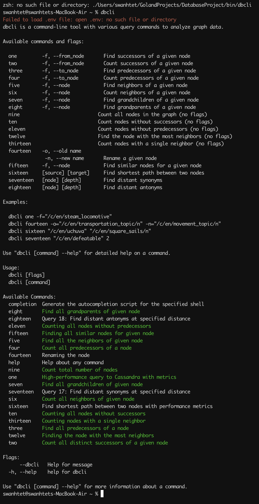
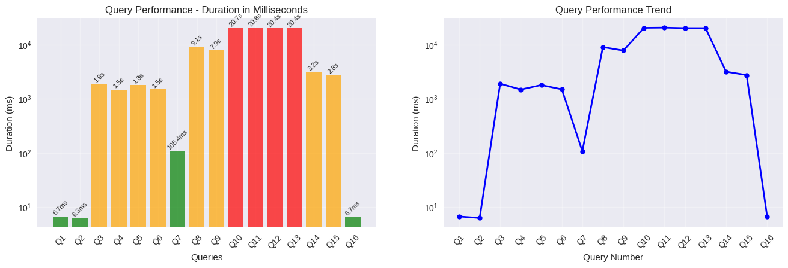

# Database Project

## Team Members
- Swan Htet Aung Phyo
- Aung Zayar Moe

## Technology Stack

### Database Technology
- **Cassandra**

### CLI and Data Parser Language
- **Go (Golang)**
- **CobraCli**

### Containerization
- **Docker**

## Cassandra Architecture & Query Language

#### **Architecture:**
Cassandra is a distributed NoSQL database designed for high availability and scalability across multiple nodes. It uses a peer-to-peer architecture with no single point of failure, employing consistent hashing for data distribution and replication across cluster nodes.

## Cassandra Optimization Parameters

**Code-Level Parameters:**
- **Consistency Levels:** Use ONE/LOCAL_ONE for fast writes, QUORUM/LOCAL_QUORUM for balanced consistency
- **Batch Size:** Keep batches under 100KB and limit to 100 statements per batch
- **Connection Pool:** Set pool size to 2-8 connections per host in Go driver
- **Request Timeout:** Configure 10-30 seconds based on query complexity

**Infrastructure Parameters:**
- **Replication Factor:** Set to 3 for production environments for fault tolerance
- **Heap Size:** Configure JVM heap to 8-14GB (never exceed 50% of RAM)
- **Compaction:** Use SizeTieredCompactionStrategy for write-heavy, LeveledCompactionStrategy for read-heavy
- **Read/Write Ratio:** Tune based on workload - typically 70/30 or 80/20 read/write split
- **Token Range:** Use 256 tokens per node for optimal load distribution


#### **Query Language (CQL):**
Cassandra Query Language (CQL) provides SQL-like syntax for interacting with Cassandra databases. Example queries include:

```cql
CREATE KEYSPACE project_db WITH replication = {'class': 'SimpleStrategy', 'replication_factor': 3};

CREATE TABLE users (id UUID PRIMARY KEY, name TEXT, email TEXT);

INSERT INTO users (id, name, email) VALUES (uuid(), 'John Doe', 'john@example.com');

SELECT * FROM users WHERE id = 12345678-1234-1234-1234-123456789012;
```

#### **Nature:**
Cassandra excels in write-heavy workloads, offering linear scalability and fault tolerance. It uses eventual consistency and is optimized for time-series data, making it ideal for applications requiring high throughput and availability over strict consistency.

## Real World Applications

- **Netflix** uses Cassandra for storing user viewing history and recommendations across global data centers.
- **Instagram** powers photo storage and social interactions for billions of users worldwide.
- **Uber** manages real-time location tracking and ride


## Schema Definiation

Our Implementation of graph data in cassandra

```cql
--- Edge table
create table edges(
    from_node text,
    to_node   text,
    relation  text,
    edge_id   uuid,
    primary key (from_node, to_node, relation, edge_id)
);


-- node table
create table node(
    name    text,
    label   text,
    node_id uuid,
    primary key (name, label)
);
```

# Data Processing and performence

 Parser and data insertion combined time


 ```shell
swanhtet@swanhtets-MacBook-Air DatabaseProject % make parse
🚀 Starting Cassandra loader...
📁 Using file: /Users/swanhtet/Downloads/cskg.tsv
✅ Connected to Cassandra at 127.0.0.1/final_schema
📂 Reading nodes from file...
📦 Total nodes: 2160968 (in 21610 batches)
📂 Reading edges from file...
🔗 Total edges: 6001531 (in 60016 batches)
⚙  Inserting nodes sequentially...
⚙  Inserting edges sequentially...
✅ All inserts completed in 4m10.182267125s

🧠 Memory Usage Report:
  HeapAlloc:    287312 -> 1828653712
  TotalAlloc:   287312 -> 15238641600
  NumGC:        0 -> 14
Done!
 ```

# CLI

- **CLI USAGE**



# Query Time analysis



